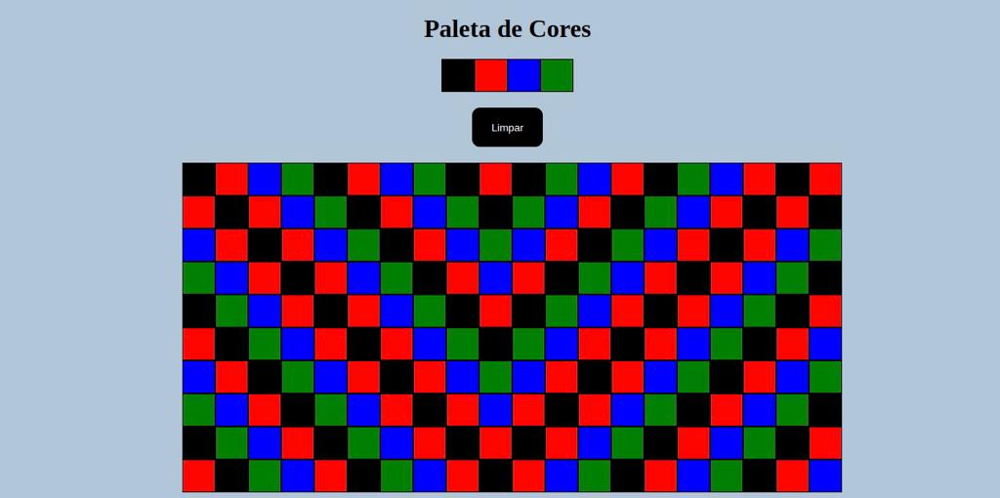
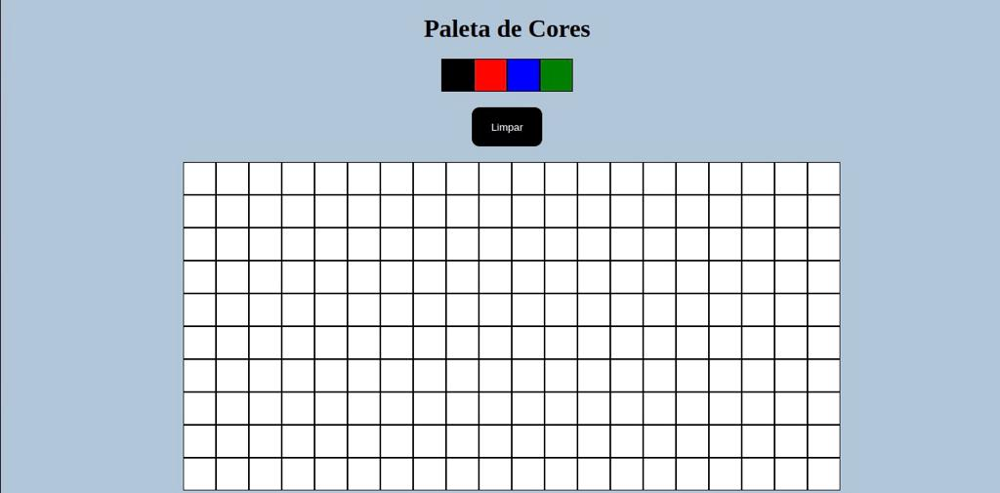

# Projeto Pixel-Art

# Contexto
Este projeto é simplesmente divertido e funcional, a ideia é criar ou replicar imagens utlizando o quadro de pixels disponível.

## Técnologias usadas

Front-end:
> Desenvolvido usando: HTML5, CSS3, JavaScript

## Instalando Dependências

> Para essa aplicação não precisaremos fazer nenhuma instalação

## Executando aplicação

> Após você fazer o clone da aplicação, a indicação é você ter a extensão "Go Live" no VsCode e utilizá-la.